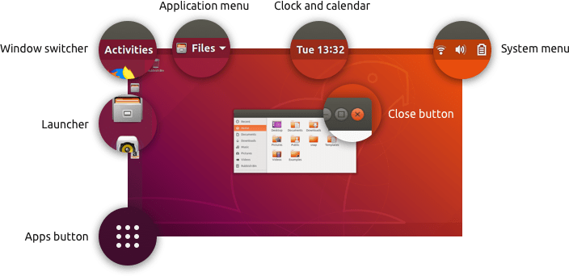

<!-- LOGO DIREITO -->
<a href="#atividades-gerais"></a>

# Atividades gerais

<p align="left">
  <a href="https://github.com/JonathanTSilva/HL-Linux">
    
  </a>
</p>

✔️ As principais atividades gerais em um ambiente Linux para facilitar a utilização rotineiro do sistema.

<!-- SUMÁRIO -->
- [Atividades gerais](#atividades-gerais)
  - [1. Manuseio de pacotes](#1-manuseio-de-pacotes)
    - [1.1. Atualizar pacotes já instalados](#11-atualizar-pacotes-já-instalados)
    - [1.2. Instalar por um repositório terceiro](#12-instalar-por-um-repositório-terceiro)
    - [1.3. Caso não saiba o nome do pacote](#13-caso-não-saiba-o-nome-do-pacote)
    - [1.4. Instalando o pacote](#14-instalando-o-pacote)
    - [1.5. Listando os pacotes instalados](#15-listando-os-pacotes-instalados)
    - [1.6. Deletando algum pacote](#16-deletando-algum-pacote)
  - [2. Manuseio de arquivos](#2-manuseio-de-arquivos)
    - [2.1. Descompactar arquivos por um software](#21-descompactar-arquivos-por-um-software)
    - [2.2. Descompactar arquivos por comandos raiz](#22-descompactar-arquivos-por-comandos-raiz)
  - [3. Troca de tema](#3-troca-de-tema)
    - [3.1. 🏆 Melhores temas](#31--melhores-temas)
      - [3.1.1. Gnome](#311-gnome)

## 1. Manuseio de pacotes

Abaixo estão alguns passos utilizados para a instalação de softwares no linux:

### 1.1. Atualizar pacotes já instalados


### 1.2. Instalar por um repositório terceiro

Se quiser instalar um programa de um repositório específico de terceiros, adicione-o usando o seguinte comando:

```console
sudo add-apt-repository <nome do repositório>
```

### 1.3. Caso não saiba o nome do pacote

Caso não saiba o nome do pacote que deseja instalar, é possível procurá-lo pelo comando:

```console
apt-cache search <termo de busca>
```

Uma lista irá aparecer com todos os pacotes que correspondem com o termo em questão. Se muitos itens forem exibidos de uma só vez, digite novamente o comando e dê um espaço para navegar pela lista. Para consultar mais detalhes sobre o pacote, execute o comando `apt-cache showpkg <nome do pacote>`, que irá exibir a versão do software, dependências e outras informações.

### 1.4. Instalando o pacote

```console
sudo apt install <nome do pacote>
```

Para atualizar um pacote já instalado sem precisar reinstalá-lo, use o comando:

```console
sudo apt install <nome do pacote> --only-upgrade
```

### 1.5. Listando os pacotes instalados

```console
sudo dpkg –list
```

O comando acima irá listar todos os pacotes instalados na máquina. Se a lista for longa demais, use a barra de espaço para navegar entre os resultados.

### 1.6. Deletando algum pacote

```console
sudo apt remove <nome do pacote>
```

Essa opção vai remover os binários instalados dele (mas não os arquivos de configuração). Para remover por completo algum software, utilize:

```console
sudo apt purge <nome do pacote>
```

## 2. Manuseio de arquivos

### 2.1. Descompactar arquivos por um software

O software que utilizo para descompactar arquivos no linux é o 7zip. Para baixá-lo, basta comandar:

```console
sudo apt install p7zip-full
```

Verifique se o pacote está instalado corretamente ou não usando o comando `7z`.

### 2.2. Descompactar arquivos por comandos raiz

Há diversas formas de descompactar arquivos. De uma forma raiz, para cada tipo de arquivos teremos um comando resumidos pela lista abaixo:

- .zip: unzip nome_do_arquivo;
- .tar.gz ou .tgz: tar xvzf nome_do_arquivo;
- .gz: gunzip nome_do_arquivo;
- .tbz ou .tar.bz2: tar xjf nome_do_arquivo.

## 3. Troca de tema

Apesar de gostar do tema do Ubuntu/PopOS/ZorinOS, prefiro alterá-lo para um muito utilizado pela comunidade: Flat Remix. Por isso, este será utilizado como exemplo para alteração de tema no Ubuntu. Pode-se atualizar baixando-o pela página oficial do pacote, utilizando o gerenciador apt ou por um repositório do GitHub.

Primeiramente, é necessário baixar o Gnome Tweaks para manusear os temas:

```console
sudo apt install gnome-tweaks
```

Tendo baixado o Tweaks, basta entrar com estes comandos para instalar o Flat Remix, ou para outros temas, verificar respectivas documentações:

```console
sudo add-apt-repository ppa:daniruiz/flat-remix
sudo apt update
sudo apt install flat-remix-gnome
```

Assim, iniciar o tweaks para fazer as devidas modificações.

### 3.1. 🏆 Melhores temas

#### 3.1.1. Gnome

- Materia
- Flat Remix