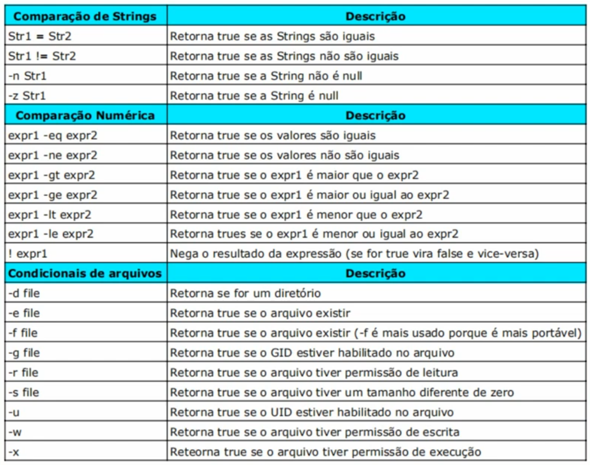

<!-- LOGO DIREITO -->
<a href="#do-básico-ao-avançado-no-shell-script"></a>

# Do básico ao avançado no Shell Script

<p align="left">
  <a href="https://github.com/JonathanTSilva/HL-Linux">
    
  </a>
</p>

👾 Aprenda a dominar o Shell Script com esse documento.

<!-- SUMÁRIO -->
- [Do básico ao avançado no Shell Script](#do-básico-ao-avançado-no-shell-script)
  - [1. Introdução](#1-introdução)
    - [1.1. O que é o Shell Script?](#11-o-que-é-o-shell-script)
    - [1.2. Vantagens](#12-vantagens)
    - [1.3. Desvantagens](#13-desvantagens)
  - [2. Básico](#2-básico)
    - [2.1. Variáveis](#21-variáveis)
    - [2.2. Operações matemáticas](#22-operações-matemáticas)
    - [2.3. Funções](#23-funções)
    - [2.4. Condicionais](#24-condicionais)
    - [2.5. Laços](#25-laços)
  - [3. Programa de automação real](#3-programa-de-automação-real)
    - [3.1. Pré-requisitos](#31-pré-requisitos)
    - [3.2. Primeiro código](#32-primeiro-código)
    - [3.3. Primeiro script - pratica1.sh`](#33-primeiro-script---pratica1sh)
    - [3.4. Aprimoramento do primeiro script](#34-aprimoramento-do-primeiro-script)
      - [3.4.1. Adicionar variáveis - pratica2.sh](#341-adicionar-variáveis---pratica2sh)
      - [3.4.2. Adicionar funções - pratica3.sh](#342-adicionar-funções---pratica3sh)
      - [3.4.3. Exit codes](#343-exit-codes)
      - [3.4.4. Aplicar condicionais - pratica4.sh](#344-aplicar-condicionais---pratica4sh)
      - [3.4.5. Lista de pacotes - pratica5.sh](#345-lista-de-pacotes---pratica5sh)
      - [3.4.6. Parsing de URL - pratica6.sh](#346-parsing-de-url---pratica6sh)
      - [3.4.7. Teste de requisitos - pratica7.sh](#347-teste-de-requisitos---pratica7sh)
      - [3.4.8. Redirecionamento de comandos](#348-redirecionamento-de-comandos)
      - [3.4.9. Tratando as saída do script - pratica8.sh](#349-tratando-as-saída-do-script---pratica8sh)
      - [3.4.10. Colorindo o script - prática9](#3410-colorindo-o-script---prática9)
      - [3.4.11. Organização do código](#3411-organização-do-código)
  - [4. Avançado](#4-avançado)
    - [4.1.](#41)

<!-- VOLTAR AO ÍNICIO -->
<a href="#"></a>

## 1. Introdução

### 1.1. O que é o Shell Script?

Shell Script é uma linguagem de programação nativa do linux. Qualquer distribuição Linux que for utilizada, terá o **bash** nativamente instalado, e ele é o compilador dessa linguagem. Entretanto, também funciona em outros sistemas Unix-based:

- MacOS
- FreeBSD
- Solaris
- HP-UX

> **Nota:** o shell script é amplamente utilizado para automatizar tarefas maçantes do dia-a-dia.

### 1.2. Vantagens

Abaixo, estão apresentadas algumas das principais vantagens do shell script:

- Curva de aprendizado muito rápida;
- Tudo o que você faz no Terminal, é só colocar em um script e adicionar uma lógica;
- Muito rápido de escrever;
- Serve para SysAdmins e para usuários finais também;
- Mesmo sendo uma linguagem simples, você tem controle de fluxo, variáveis, comentários, arrays, funções...

### 1.3. Desvantagens

Já como desvantagens, têm-se:

- Não possui classes, threading, tipos de dados, como outras linguagens mais robustas tem (Python, Perl, Ruby...);
- Pode ser perigoso, dependendo da instrução escrita no script, já que roda tudo diretamente no sistema operacional;
- Não é muito intuitiva como outras linguagens.

<!-- VOLTAR AO ÍNICIO -->
<a href="#"></a>

## 2. Básico

### 2.1. Variáveis

Assim como em todas outras linguagens, as variáveis são utilizadas para armazenar valores. Especificamente no Shell Script, ela pode ser: ou um valor numérico, ou Strings de texto.

Geralmente, divide-se em duas partes (não há um *programming guide* para isso - apenas por experiência):

- **Globais**: declaradas em **maiúsculo** e todas as funções tem acesso;
- **Locais**: declaradas em **minúsculo** e somente a função tem acesso.

✍️ **EXEMPLO:**

```bash
$ NOME="Jonathan Silva" # Sem o export, variável somente para aquela sessão de bash
$ echo $NOME
> Jonathan Silva
$ bash # Para alterar a sessão bash
$ echo $NOME
>
$ exit
$ export NOME # Torna a variável global
$ bash 
$ echo $NOME
> Jonathan Silva
```

Entretanto, quando uma variável é declarada dentro de um script, ela vai estar disponível apenas dentro daquele script, nem com o `export`. Para cada execução de script, é criado uma nova sessão de bash e depois mata o processo da sessão.

Se só é declarado a variável localmente (sem o `export`), e dar o comando para mostrar as variáveis de ambiente (e.g. `env | grep NOME`), não será mostrado a variável criada por ela não é global.

> **Nota:** ao criar uma nova sessão, filha da atual, é possível personalizar a visualização dos processos que a envolve digitando `ps --forest`. Assim, uma sessão filha, enxerga todas as variáveis que são globais no pai.
> **Dica:** o export pode ser feito diretamente com `export NUMERO=1`.

### 2.2. Operações matemáticas

As operações matemáticas básicas podem ser realizadas da seguinte forma (entre muitas outras formas para bem fazê-las):

```bash
$ NUMERO_1=2
$ NUMERO_2=4
$ echo $(($NUMERO_1+$NUMERO_2)) # Soma as duas variáveis
> 6
```

E também pode ser colocado dentro de uma variável:

```bash
$ TOTAL=$(($NUMERO_1+$NUMERO_2)) # Variável que soma as duas variáveis anteriormente declaradas
$ echo $TOTAL
> 6
```

### 2.3. Funções

Funções dentro de Shell Script (como em qualquer outra linguagem) podem ser definidas como uma parte do código (ou código) que é responsável por uma ação específica. Elas são utilizadas para organizar o código. Com as funções, a manutenção do código é facilitada. Podem ser declarada direto no terminal da seguinte forma:

```bash
$ lla () {ls -la;} # Declarando a função lla para realizar o comando ls -la
$ lla
```

### 2.4. Condicionais

Condicionais são utilizadas para definir o fluxo de execução de um script. No Shell Script. possui as mesmas funções das condicionais de outras linguagens de programação. Exemplo:

```bash
if [[ -d /var ]]; then
- echo "Diretório existe"
else
- echo "Diretório não existe"
fi
```

> **Nota:** o shell script em si não testa apenas condições, mas também instruções.
> **Nota:** ao observar o código acima, verifica-se os espaços e os colchetes, que representam o comando `test` do shell. Se eles não forem colocados, o código não será executado.

O `-d` atrelado ao `if`, é para testar se o diretório existe. Caso seja adicionado o sinal `!` antes deste comando, é retornado false daquela expressão.

Abaixo, a tabela apresenta as principais expressões que existem no shell script.

<p align="center">
  <a href="#"></a>
</p>

> **Dica:** o comando `man bash` retorna todas as funções e opções existentes para o shell script.

Exemplo de utilização do comando `test`:

```bash
$ mkdir pasta
$ test -d pasta # Testa se existe esse diretório
$ echo $? # O resultado do comando anterior é guardado em $?
> 0 # Se retorna zero, é verdadeiro. Qualquer coisa diferente de zero é falso
$ test -d pastaXYS
> 1 # Falso
```

### 2.5. Laços

São utilizados para executar várias vezes o mesmo código, varrer uma lista de valores, etc... No shell script há três laços: **until**, **for** e **while**. Exemplo diferentes para a mesma situação:

```bash
for i in $(seq 10); do
- echo "Contador = $i"
done
```

> **Nota:** o `seq` é um comando que vai executar o comando por tantas vezes.

```bash
i=0
while [[ $i -lt 10 ]]; do
- echo "Contador = $i"
- i=$(($i+1))
done
```

> **Nota:** o `while` não apresenta um contator (`seq`) como o for, por isso é necessário comandos a mais.

```bash
i=0
until false
do
- echo "Contador = $i"
- ((i++))
- sleep 2
done
```

Exemplo real para trazer todos os usuários do sistema:

```bash
for usuario in $(cut -d : -f 1 /etc/passwd); do # Pega a primeira coluna de todos os usuários do sistema
- echo "Usuário: $usuario";
done
```

<!-- VOLTAR AO ÍNICIO -->
<a href="#"></a>

## 3. Programa de automação real

Este capítulo aborda um exemplo de utilização real de Shell Script, para automatizar a configuração posterior à uma instalação do Ubuntu.

### 3.1. Pré-requisitos

Para viés didático, criou-se uma máquina virtual para realizar todo o estudo envolvendo Shell Script, marcando um snapshot para facilitar o backup da fase inicial da estação. Para isso, utilizou-se o VirtualBox e as seguintes configurações de VM:

- Sistema Operacional: Ubuntu 21.02;
- Memória RAM: 2 GiB;
- Disco: 50 GB;
- Memória de Vídeo: 128 MB.

Além disso, a preparação do checkpoint inicial da máquina deve conter:

- OpenSSH - para acessá-la remotamente;
- Editor de código - de sua preferência (Vim, Nano, entre outros);
  - Caso utilize o editor pela máquina cliente (como o VSCode, Atom, etc.), opte por instalar extensões que facilite a edição com conexões SSH;
- Net-tools - para facilitar os comandos de rede.

### 3.2. Primeiro código

A primeira coisa a ser feita na fase de planejamento de um script, é replicar, pausadamente, todos os comandos no terminal. Se tudo ocorrer bem nesta etapa, poderá ser passada para o Script, melhorando a solução. Como exemplo, para a automação proposta neste capítulo, há estes comandos:

```shell
sudo rm /var/lib/dpkg/lock-frontend # Remove este arquivo de lock, pois possivelmente, um processo do apt e dpkg está bloqueado e impossibilitando alteração
sudo rm /var/cache/apt/archives/lock
sudo dpkg --add-architecture i386 # Como a arquitetura dos softwares são todas em 64 bits atualmente, os programas que foram desenvolvidos para 32 bits não funcionam. Por isso é preciso adicionar essa arquitetura (i386 = 32 bits)
sudo apt update -y # Atualiza todo o repositório de pacotes
sudo add-apt-repository ppa:libratbag-piper/piper-libratbag-git -y # Adicionar o repositório do piper (gestor dos mouses da Logitech)
sudo add-apt-repository ppa:lutris-team/lutris -y # Adicionar o repositório do Lutris (gestor de jogos livre e de código aberto)
sudo apt update -y # Atualizar novamente os pacotes, agora com os novos repositórios ppa
mkdir /home/jonathan/Downloads/softwares # Cria o novo diretório para baixar os softwares
wget https://dl.google.com/linux/direct/google-chrome-stable_current_amd64.deb -P /home/jonathan/Downloads/softwares # Baixa o Google Chrome utilizando wget
wget https://github.com/Automattic/simplenote-electron/releases/download/v1.8.0/Simplenote-linux-1.8.0-amd64.deb -P /home/jonathan/Downloads/softwares # Baixa o SimpleNote utilizando wget
sudo dpkg -i /home/jonathan/Downloads/softwares/*.deb # Instala esses programas
sudo apt -f install -y # Instala todas as dependências desses programas (pois alguns podem não carregar as dependências)
sudo apt install snapd -y # Instala o snap direto do apt
sudo apt install winff -y # Instala o winff (conversor de vídeos e áudios) direto do apt
sudo apt install guvcview -y # Instala o guvcview (aplicativo de webcam) direto do apt
sudo apt install virtualbox -y # Instala o virtualbox direto do apt
sudo snap install spotify # Instala o spotify com o Snap
sudo apt update && sudo apt dist-upgrade -y # Atualizar os pacotes e a distribuição
sudo apt autoclean # Limpa o cache do sistema
sudo apt autoremove -y # Limpa os pacotes que não são mais necessários
```

### 3.3. Primeiro script - [pratica1.sh`][1]

Após ter executado todos os comandos da seção acima, vamos criar o primeiro script para automatizar aquele processo.

O Shell Script geralmente tem a extensão `.sh`. Assim, como primeiro passo, copie aqueles comandos anteriores dentro deste primeiro arquivo, que para fins didáticos, será nomeado como [pratica1.sh][1]. Assim, siga os seguintes passos para finalizar o primeiro script dentro dos padrões de desenvolvimento:

1. Sempre a primeira linha será definida pela declaração do compilador responsável por rodar aquele script (bash, zshell, fish etc.), através de um **shebang**: `#!/bin/bash/`;

> **Nota:** para verificar qual o local do seu shell, utilizar o comando `which [shell]`.

2. Após criado o Script, se tentar inciar ele pelo terminal com `./pratica1.sh`, um erro de permissão negada será mostrado. Isso acontece porque todo novo Script, tem apenas permissão de leitura (verificar com o `ls -l`). Para alterar a permissão, rodar `chmod +x pratica1.sh`;

> **Nota:** ao alterar a permissão e dar o comando `ls`, o arquivo que tem permissão de execução será mostrado de forma destacada.

Pronto! Temos o primeiro shell script para executar as tarefas de forma automática, mas ainda fora das boas práticas. Note que para rodar um script precisamos do `./`. Há uma outra forma de rodar ele, que independe do **shebang**: basta adicionar o compilador antes de chamar o arquivo por linha de comando (e.g. `bash pratica1.sh`).

Entretanto, alguns programadores preferem, pela praticidade, também automatizar esse processo criando um diretório para os scripts (geralmente chamado `~/.bin/`) e adiciona-lo à variável `PATH`, para que seja lido em qualquer lugar. Para isso, realizar os seguintes passos no terminal:

```bash
$ echo $PATH
> /usr/local/sbin:/usr/local/bin:/usr/sbin:/usr/bin:/sbin:/bin:/usr/games:/usr/local/games:[...]
# Criar pasta para os scripts
$ mkdir ~/.bin
# Copiar todos os seus scripts para dentro do .bin, neste caso:
$ cp pratica1.sh ~/.bin/
# Colocar o diretório .bin dentro da variável PATH:
$ export PATH=$PATH:/home/jonathan/.bin
# Executar o script
$ pratica1.sh
```

### 3.4. Aprimoramento do primeiro script

Nas próximas fases deste capítulo, vamos aperfeiçoar o script realizado na seção anterior, adicionando estrutura, varáveis, funções etc. ao código, comentando e organizando da melhor maneira.

#### 3.4.1. Adicionar variáveis - [pratica2.sh][2]

Em uma situação real, imagine que, na linha que adiciona o repositório `ppa`, seja alterado por parte da organização fornecedora, o endereço desse. Seria necessária edição no código toda vez que isso acontecesse. Pior ainda, imagina se esse link fosse utilizado muitas vezes ao longo do script...

Para contornar tal situação, inicialmente, cria-se variáveis para que as seguintes situações:

1. Se há um elemento que pode ser alterado sem seu controle;
2. Quando é um elemento muito grande (e.g. links);
3. Quando o elemento é utilizado muitas vezes.

Para o nosso caso teste, utilizaremos as seguintes variáveis em nosso novo script ([pratica2.sh][2]):

> **Nota:** relembrar das definições e condições de variáveis apresentadas na [seção 2.1](#21-variáveis).

```shell
# PPA
PPA_PIPER_LIBRATBAG="ppa:libratbag-piper/piper-libratbag-git"
PPA_LUTRIS="ppa:lutris-team/lutris"

# URL
URL_GOOGLE_CHROME="https://dl.google.com/linux/direct/google-chrome-stable_current_amd64.deb"
URL_SIMPLE_NOTE="https://github.com/Automattic/simplenote-electron/releases/download/v1.8.0/Simplenote-linux-1.8.0-amd64.deb"

# DIRECTORIES
DIR_DOWNLOAD_SOFTWARES="$HOME/Downloads/softwares"
```

Tendo declarado essas variáveis globais (*uppercase*), chamar no script da seguinte forma: `$PPA_LUTRIS` ou `"$PPA_LUTRIS"` (para manter a mesma formatação).

#### 3.4.2. Adicionar funções - [pratica3.sh][3]

A segunda parte do aperfeiçoamento do programa, se dá pela formulação das funções existentes no código. Para isso, passar um pente fino em cada etapa do seu comando inicial e definir o que está sendo feito em cada linha de comando. Feito isso, adicionar funções que definem essas atividades. No caso deste documento:

```shell
remove_locks () {
}

add_architecture_i386 () {
}

update_repos () {
}

add_ppas () {
}

install_deb_pkgs () {
}

install_apt_pkgs () {
}

install_snap_pkgs () {
}

upgrade_and_clean_system () {
}
```

Para cada função, adicionar os respectivos comandos iniciais (vide [pratica3.sh][3]).

Além de apenas dividir o código em funções, é necessário chamar as funções criadas dentro do Script. Por isso, no final do script, adicionar uma parte para Debug e chamar cada uma delas.

```shell
remove_locks
add_architecture_i386
add_ppas
update_repos
install_deb_pkgs
install_apt_pkgs
install_snap_pkgs
upgrade_and_clean_system
```

#### 3.4.3. Exit codes

Todos os comandos Linux ou Unix executados por um shell script ou usuário têm uma saída de status, que são números inteiros. A saída 0 significa que o comando foi executado com sucesso. Já um número diferente de zero (1-255), remete ao status de falha de um comando.

Para descobrir qual a o código de saída (*exit code*) de um comando, utilizar uma variável particular para este caso: `$?`, que retornará o exit code do último comando dado. Observe o exemplo abaixo:

```bash
$ date
> Thu Mar 3 09:04:13 -03 2022
$ echo $?
> 0
```

> **Nota:** o *exit code* também pode ser obtido por um comando `printf`: `printf '%d\n' $?`.

Sabendo disso, fica mais fácil imaginar como manusear os resultados de funções dentro de condicionais, laços, funções etc. em um Shell Script: com os *exit codes*. Em suma, é possível colocar o comando `exit [0-255]` no retorno de uma função para que seja salvo na variável `$?`.

A tabela abaixo apresenta os exit codes recomendados para o seu shell script:

| Exit status | Descrição                                                               |
| :---------- | :---------------------------------------------------------------------- |
| `1`         | Saída para erros gerais                                                 |
| `2`         | Uso indevido de builtin do shell (de acordo com a documentação do Bash) |
| `126`       | O comando requisitado não pode ser executado                            |
| `127`       | Comando não encontrado                                                  |
| `128`       | Argumento inválido para o comando de saída                              |
| `128+n`     | Sinal de erro fatal "n"                                                 |
| `130`       | Script Bash encerrado por **Ctrl+C**                                    |
| `255*`      | Status de saída fora do range                                           |

> **Dica:** os *exit codes* são extremamente importantes para manusear os dados e funções dentro de condicionais.

#### 3.4.4. Aplicar condicionais - [pratica4.sh][4]

A primeira implementação de condicionais no nosso script de prática ([pratica4.sh][4]) será dentro da função `install_deb_pkgs`, visto que há o comando `mkdir` criando sempre a pasta `"$DIR_DOWNLOAD_SOFTWARES"`, mesmo sem conferir se já existe o diretório.

Assim, segue o código aplicado:

```shell
if [[ ! -d "$DIR_DOWNLOAD_SOFTWARES" ]]; then # Testa: caso o diretório ... não exista, então
  mkdir "$DIR_DOWNLOAD_SOFTWARES"
else
  echo "Esse diretório já existe!"
fi
```

> **Nota:** vale ressaltar os comandos `&&` e `||` que podem ser utilizados dentro de condicionais. `&&` passa quando o comando anterior for verdadeiro (*exit code* = 0) e `||` quando o primeiro for falso (*exit code* > 0)

Neste caso, incorporando os operadores `&&` (*and*) e `||` (*or*) dentro da mesma função, teria:

```shell
[[ ! -d "$DIR_DOWNLOAD_SOFTWARES" ]] && mkdir "$DIR_DOWNLOAD_SOFTWARES"
```

Note que este método impossibilita a utilização de um `else`na função. Em contrapartida, duas linhas são "economizadas" da memória. Por isso é recomendado essa utilização sempre que possível, quando não for preciso utilizar o `else`.

#### 3.4.5. Lista de pacotes - [pratica5.sh][5]

As funções responsáveis pela instalação dos pacotes apresenta comandos repetitivos e que não são tratados, como no exemplo desta prática ([pratica5.sh][5]). Quatro pacotes são instalados em comandos diferentes e não é verificado se estes já estão instalados, gastando tempo de execução.

Para tal validação, as seguintes listas foram criadas:

```shell
SOFTWARES_TO_INSTALL_APT={
  snapd
  winff
  guvcview
  virtualbox
}
```

> **Nota:** sempre que houver comandos repetitivos que alteram alguns argumentos, é recomendado atribuir todos em uma lista. Essas listas devem separar os atributos por espaço (nas boas práticas, utiliza-se a quebra de linha).

Para a instalação destes pacotes dentro da lista, acrescentar um laço que instale cada um:

```shell
for software in ${SOFTWARES_TO_INSTALL_APT[@]}; do
  sudo apt install $software -y
done
```

> **Nota:** a nomenclatura utilizada pelo shell script para trazer todos os itens da lista é [@].

Feito isso, teremos uma automação do processo de instalação dos pacotes **apt**, mas ainda não acontece uma validação para saber se esses pacotes já estão instalados na máquina. Dessa forma, essa validação pode ser feita utilizando juntos os comandos: `dpkg`e `grep`. Adicionalmente, utiliza-se a opção `-q` (quiet) para que nada seja mostrado na tela:

```shell
for software in ${SOFTWARES_TO_INSTALL_APT[@]}; do
  if ! dpkg -l | grep -q $software; then
    sudo apt install $software -y;
  else
    echo "[INFO] - O pacote $software já está instalado.";
done
```

Note que a sintaxe do `if` mudou para esta situação, ao retirar os colchetes utilizados para o teste de diretório, pois para testar comando, a condicional precisa necessariamente ler a saída direta do comando, e não o *exit code*.

Dessa forma, realizar as mesmas etapas anteriores para cada parte do código que apresentar recorrência. Neste caso, criar listas e validações para as funções `install_snap_pkgs` (utilizando o comando `snap list | grep $software`)

>**Nota:** se atente aos comandos utilizados para cada situação e gerenciador de pacotes, pois neste caso, será diferente a validação dos pacotes **apt** e **snap**.

#### 3.4.6. Parsing de URL - [pratica6.sh][6]

A função exemplo a ser aprimorada nesta etapa é a `download_deb_pkgs`. Percebe-se que não há uma validação nesta função ao baixar os pacotes **.deb**,, pois não há uma verificação se estes pacotes já estão lá. Entretanto, o próprio comando `wget` já apresenta uma opção que realiza esta validação: `-c`.

Da maneira como foi programado até agora, está sendo instalado algumas variáveis específicas. Imagina em uma situação real, que há diversos pacotes .deb a serem baixados e de URLs distintas, sendo necessário uma criação de uma nova lista. Logo, realocar as URLs das variáveis `URL_GOOGLE_CHROME` e `URL_SIMPLE_NOTE`:

```shell
SOFTWARES_TO_INSTALL_DEB=(
    https://dl.google.com/linux/direct/google-chrome-stable_current_amd64.deb # Google Chrome
    https://github.com/Automattic/simplenote-electron/releases/download/v1.8.0/Simplenote-linux-1.8.0-amd64.deb # Simple Note
)
```

O tratamento desta lista pode ser feito com os seguintes comandos:

```shell
for url in %{SOFTWARES_TO_INSTALL_DEB[@]}; do
  wget -c $url -P "$DIR_DOWNLOAD_SOFTWARES"
done
```

Mesmo com esse tratamento feito, há um problema neste código: não se tem o nome do pacote que está sendo instalado, apenas uma URL. Portanto, não é possível realizar um `grep` para verificar se já está instalado.

Um *workaround* encontrado para essa situação, é pegar o tratar a URL para pegar uma palavra chave. Por exemplo, na seguinte URL https://dl.google.com/linux/direct/google-chrome-stable_current_amd64.deb, o nome **google** deve ser extraído. Para isso, utilizaremos uma expansão de parâmetros (do inglês *shell parameter expansion*), que possibilita a retirada deste termo. Para maiores informações, verificar a documentação do [Shell Variable Expansion][7].

A primeira expansão utilizada será `${parameter##word}`, que retorna tudo depois da `word` do `parameter`. Exemplo:

```shell
$ URL="https://github.com/Automattic/simplenote-electron/releases/download/v1.8.0/Simplenote-linux-1.8.0-amd64.deb"
$ echo ${URL##*/} # Retorna tudo que vem depois do último /
> Simplenote-linux-1.8.0-amd64.deb
```

> **Nota:** não é possível utilizar mais de um *variable expansion* na mesma função, obrigando assim, a trabalhar com a saída do anterior.

Com esse dado na mão, deve-se aplicar agora uma substituição de `-` por `_` utilizando o comando `sed`, afim de padronizar os resultados:

```shell
$ echo ${URL##*/} | sed 's/-/_/g'
> Simplenote_linux_1.8.0_amd64.deb
```

Por fim, cortar a string anterior para tudo o que vier antes do `_`, com o comando `cut`:

```shell
$ echo ${URL##*/} | sed 's/-/_/g' | cut -d _ -f 1
> Simplenote
```

As opções `-d` e `-f` do `cut` equivalem, respectivamente, ao delimitador (_) e à coluna (1).

Retornando ao exemplo prático do documento ([pratica6.sh][6]), utilizar o seguinte comando dentro do for da função `download_deb_pkg`:

```shell
for url in %{SOFTWARES_TO_INSTALL_DEB[@]}; do
  url_extract=$(echo ${url##*/} | sed 's/-/_/g' | cut -d _ -f 1)
  wget -c $url -P "$DIR_DOWNLOAD_SOFTWARES"
done
```

Além da extração de atributo do URL, é necessário tratar os estes dados para a instalação, resultando em um código final:

```shell
download_and_install_deb_pkgs () {
    [[ ! -d "$DIRETORIO_DOWNLOAD_PROGRAMAS" ]] && mkdir "$DIRETORIO_DOWNLOAD_PROGRAMAS"
    for url in %{SOFTWARES_TO_INSTALL_DEB[@]}; do
        extract_url=$(echo ${url##*/} | sed 's/-/_/g' | cut -d _ -f 1)
        if ! dpkg -l | grep -iq $extract_url; then
            wget -c "$url" -P "$DIR_DOWNLOAD_SOFTWARES"
            sudo dpkg -i $DIR_DOWNLOAD_SOFTWARES/${url##*/}
        else 
            echo "[INFO] O programa $extract_url já está instalado"
        fi
    done
    sudo apt -f install -y
}
```

Pode ser que exista alguma URL que não entre no tratamento de dados realizados acima. Para esses casos, será desenvolvida uma nova forma de tratamento.

#### 3.4.7. Teste de requisitos - [pratica7.sh][8]

Neste ponto, já possuímos um script quase todo automatizado. Entretanto, sempre lembre de ler novamente o seu script e verificar se existe alguma dependência externa, realizando a seguinte pergunta:

* Se rodar esse script no meu Linux zerado, ele vai conseguir rodar 100%?

No nosso caso atual de estudo ([pratica7.sh][8]), não será possível realizar a execução, pois são utilizados os pacotes `wget` e `snap`, que não vêm instalados por *default* na maioria dos sistemas. Por outro lado, há o dpkg. Outro requisito é a configuração prévia de conexão com a internet para que estes gerenciadores de pacotes executem seus comandos com sucesso.

Por esse e outros motivos, é necessária esta etapa de teste de requisitos, para certificar-se que tudo ocorrerá normalmente. Para isso, seguir os passos para realizar as validações da nossa prática:

1. Validação do `wget`:
   * verificar se o pacote já está instalado, utilizando `which`:

```shell
if [[ ! -x `which wget` ]]; then
    echo "[INFO] - O programa wget não está instalado."
    echo "[INFO] - Instalando wget..."
    sudo apt install wget -y
else
    echo "[INFO] - O programa wget já está instalado."
fi
```

2. Validação do `snap`:
   * verificar se o pacote já está instalado, utilizando `which`:

```shell
if [[ ! -x `which snap` ]]; then
    echo "[INFO] - O programa snap não está instalado."
    echo "[INFO] - Instalando snap..."
    sudo apt install snap -y
else
    echo "[INFO] - O programa snap já está instalado."
fi
```

3. Validação da conexão com a internet:
   * realizar validação com o ping e redirecionador de comando:

```shell
if ! ping -c 1 8.8.8.8 -q &> /dev/null; then
  echo "[ERROR] - Seu computador não tem conexão com a Internet. Verifique os cabos e o modem."
  exit 1
else
  echo "[INFO] - Conexão com a Internet funcionando normalmente."
fi
```

> **Nota:** a opção `-c` para alguns comandos (como o `ping`) é um limitador de resposta, passando o tanto de vezes que o comando deve ser executado.

>  **Nota:** no código acima, é utilizado um redirecionador de comandos `&> /dev/null` que será tratado nas próximas seções.

#### 3.4.8. Redirecionamento de comandos

É possível usar operadores de redirecionamento para redirecionar fluxos de entrada e saída de comandos dos locais padrão para locais diferentes. O local do fluxo de entrada ou saída é conhecido como **identificador**.

A tabela a seguir lista operadores que você pode usar para redirecionar fluxos de entrada e saída de comandos.

| Operador de redirecionamento | Descrição                                                                                                                    |
| :--------------------------- | :--------------------------------------------------------------------------------------------------------------------------- |
| `>`                          | Grava a saída do comando em um arquivo ou dispositivo, como uma impressora, em vez de gravar na janela do prompt de comando. |
| `<`                          | Lê a entrada do comando a partir de um arquivo, em vez de ler a partir do teclado.                                           |
| `>>`                         | Acrescenta a saída do comando ao final de um arquivo, sem excluir as informações já existentes no arquivo.                   |
| `>&`                         | Grava a saída de um identificador na entrada de outro identificador.                                                         |
| `<&`                         | Lê a entrada de um identificador e grava essa entrada na saída de outro identificador.                                       |
| <code>&#124;</code>          | Le a saída de um comando e grava essa saída na entrada de outro comando. Também conhecido como *pipe*.                       |

Por padrão, a entrada do comando (isto é, o identificador `STDIN`) é enviada do teclado para o **Cmd.exe**; em seguida, esse arquivo envia a saída do comando (isto é, o identificador `STDOUT`) para a janela do prompt de comando.

A tabela a seguir lista os identificadores disponíveis.

| Identificador | Equivalente numérico do identificador | Descrição                                                                                                 |
| :------------ | :-----------------------------------: | :-------------------------------------------------------------------------------------------------------- |
| `STDIN`       |                   0                   | Entrada do teclado (linha de comando).                                                                    |
| `STDOUT`      |                   1                   | Saída para a janela do prompt de comando.                                                                 |
| `STDERR`      |                   2                   | Saída de erro para a janela do prompt de comando.                                                         |
| `UNDEFINED`   |                  3-9                  | Estes identificadores são definidos individualmente pelo aplicativo e são específicos de cada ferramenta. |

Exemplo:

```bash
$ apt update 2> saida_error
> Lendo listas de pacotes... Pronto
$ cat saida_error
> E: Não foi possível abrir arquivo de trava /var/... (13: Permissão negada)
> ...
```

Ou, trabalhando no exemplo acima, pode-se direcionar um comando para dois+ lugares diferentes, como visto na continuação do exemplo acima:

```bash
$ apt update 1> saida_error 2>&1 # Manda o STDOUT para o saida_error e o STDERR para o mesmo lugar do STDOUT
$ cat saida_error
> Lendo listas de pacotes... Pronto
> E: Não foi possível abrir arquivo de trava /var/... (13: Permissão negada)
> ...
```

Para mais informações sobre o redirecionamento de comandos, verificar o manual do bash (`man bash`).

> **Nota:** o local `/dev/null` é um dispositivo nativo de todas as distribuições Linux e funciona como um "buraco negro do Linux", ou seja, não serve para exatamente nada (como se fosse uma lixeira que tritura todos enviados para lá).

#### 3.4.9. Tratando as saída do script - [pratica8.sh][9]

O script no estado atual ([pratica7.sh][8]), ao ser executado, está mostrando muita resposta na tela do prompt de comando, podendo em alguns casos ser até prejudicial para o desempenho. Assim, é necessário reduzir as mensagens desnecessárias que são mostradas, com o auxílio dos redirecionadores de comandos, apresentados na seção anterior.

1. Adicionar mensagens em cada processo:

```shell
remove_locks () {
    echo "[INFO] - Removendo locks..."
    [...]
}

add_architecture_i386 () {
    echo "[INFO] - Adicionando arquitetura i386..."
    [...]
}

update_repos () {
    echo "[INFO] - Atualizando repositórios..."
    [...]
}

add_ppas () {
    echo "[INFO] - Adicionando PPAs..."
    [...]
}

download_and_install_deb_pkgs () {
    [...]
        if ! dpkg -l | grep -iq $extract_url; then
            echo "[INFO] - Baixando o arquivo $extract_url..."
            wget -c "$url" -P "$DIR_DOWNLOAD_SOFTWARES"
            echo "[INFO] - Instalando o $extract_url..."
            sudo dpkg -i $DIR_DOWNLOAD_SOFTWARES/${url##*/}
            echo "[INFO] - Instalando dependências..."
        [...]
}

install_apt_pkgs () {
    for software in ${SOFTWARES_TO_INSTALL_APT[@]};
        if ! dpkg -l | grep -q $software; then
            echo "[INFO] - Instalando o $software..."
            sudo apt install $software -y;
        else
            echo "[INFO] - O pacote $software já está instalado.";
    done
}

install_snap_pkgs () {
    for software in ${SOFTWARES_TO_INSTALL_SNAP[@]};
        if ! snap list | grep -q $software; then
            echo "[INFO] - Instalando o $software..."
            sudo snap install $software;
        else
            echo "[INFO] - O pacote $software já está instalado.";
    done
}

upgrade_and_clean_system () {
    echo "[INFO] - Fazendo upgrade e limpeza do sistema..."
    sudo apt dist-upgrade -y
    sudo apt autoclean
    sudo apt autoremove -y
}
```

Feito isso e executado o script, percebe-se que ainda está muito poluído: muitas informações aparecendo rapidamente na tela do terminal, misturando as informações inseridas, com as saídas padrão.

Para resolver isso, deve se utilizar o redirecionamento de comando para o `/dev/null`. Entretanto, se implementá-lo de forma indevida, ao debugar o código e falhar, não será possível notar esta falha, por falta de informação. Sendo assim, é extremamente importante tratar e identificar todas as condições de erro (jogando-as em logs de debug).

1. Enviar todas as saídas do código para o `/dev/null`:

```shell
sudo apt install wget -y &> /dev/null
[...]
sudo apt dist-upgrade -y &> /dev/null
sudo apt autoclean &> /dev/null
sudo apt autoremove -y &> /dev/null
```

> **Nota:** apesar de parecer uma boa ideia retirar todas as informações de debug do script, sempre deve-se perguntar qual o público final para aquele. Caso sejam usuários mais avançados, é válido deixar as informações aparentes para que haja maior controle.

#### 3.4.10. Colorindo o script - [prática9][10]

As cores em um código bash são chamadas de *escape corrector* ou *escape sequences* (sendo *escape* relacionado com a tecla `ESC`), que é uma combinação de caracteres que tem um outro significado do que aqueles digitados. Para maiores informações, verificar documentação [bash:tip_colors_and_formatting][11]

No bash, o caractere <kbd>Esc</kbd> pode ser obtido com as seguintes sintaxes:

- `\e`
- `\033`
- `\x1B`

Exemplos:

```shell
echo -e "\e[31mHello World\e[0m" # Vermelho
echo -e "\033[31mHello\e[0m World"
```

Assim sendo, para personalizar o nosso script de prática ([prática9][10]), utilizaremos essa formatação por *escape sequences* criando variáveis de cores (para seguir as melhores práticas).

> **Nota:** sempre que utilizar desta formatação, acrescentar o parâmetro `-e` no comando `echo`.

As cores criadas para o script são:

```shell
RED="\e[1;91m"
GREEN="\e[1;92m"
BLUE="\e[1;94m"
NO_COLOR="\e[0m"
```

É muito importante criar uma variável para zerar a formatação anterior, neste caso a variável `NO_COLOR`, para que a cor fique apenas no echo que queremos. Caso não queira criar a variável, utilizar apenas o comando `\e[0m`.

> **Nota:** para adicionar mais de uma formatação, utilizar o seguinte padrão: \e[<c1>;<c2>;...;<cN>m (IDs de formatação separados por ponto e vírgula).

A aplicação destas cores no código será da seguinte forma:

```shell
# INTERNET TEST
[...]
echo -e "[ ${RED}FAIL${NO_COLOR} ] - Seu computador não tem conexão com a Internet. Verifique os adaptadores de rede, os cabos e o modem."
[...]
echo -e "[ ${BLUE}INFO${NO_COLOR} ] - Conexão com a Internet funcionando normalmente."
[...]
echo -e "[  ${GREEN}OK${NO_COLOR}  ] - Instalando wget..."
[...]
```

#### 3.4.11. Organização do código

Na busca de qualidade do script, é imprescindível a adoção de boas práticas. Algumas delas ajudam a manter o código mais legível, fácil de compreender e de manter. Lembre-se, para alcançarmos um bom código, não basta apenas que ele funcione.

Pensando nisso, e visto todo o trabalho feito com o script de prática, foi separado em tópicos o que é necessário para o seu script estar dentro dos padrões de boas práticas.

1. Estrutura:
   - deixa o código muito mais legível, limpo e esteticamente mais bonito;
   - Variáveis > Listas > Testes > Funções > Execução
2. Comentários e documentação:
   - explicar o algoritmo ou a lógica usada, mostrando o objetivo de uma variável, método, classe...
   - documentar o projeto, descrevendo a especificação do código. Desta maneira, qualquer pessoa poderá analisar um arquivo de documentação, mesmo que este não apresente o código fonte.
3. Convenções de nomes:
   - variáveis: globais com letras maiúsculas e locais com minúsculas;
   - funções: precisa de fato descrever o funcionamento do programa como um todo, como “CalculaRaizQuadrada” ou “calcula_raiz_quadrada”.
4. Forma reduzida
   - optar sempre pela forma reduzida de validações `if` quando possível. Pode-se utilizar o `&&` para condições positivas e `||` para condições negativas.
5. Outras boas práticas em diversas linguagens de programação:
   - Endentação;
   - Utilização de pacotes;
   - Tratamento de erros;
   - Padrões de projeto;
   - Deprecation;
   - Testar e depurar;
   - Versionamento;
   - Tamanho.

Outra dica muito importante é sempre colocar o seu header no início dos seus scripts, para que, lendo o header, o usuário entenda qual o objetivo, como funciona, onde foi testado, qual o histórico, quem é o desenvolvedor, mantenedor, o contato para relatar algum bug, entre outras informações.

```shell
#============================================================
#------------------------ HEADER ----------------------------
#============================================================
# UbuntuSetup.sh - post installations of Ubuntu 20.04.
# 
# DESCRIPTION
#    This is a script to configure and prepare your Ubuntu
#    environment
#
# IMPLEMENTATION
#    version         1.0.0
#    author          Jonathan T. Silva
#    license         MIT License
#    script_id       0
# 
# CHANGELOG
#    v 1.0.0 : 2022/03/08 : JonathanTSilva
#        - Script creation
#============================================================
#           Copyright (C) 2022 Jonathan T. Silva
#          https://www.github.com/JonathanTSilva
```

Um exemplo de comentário em bloco utilizado nos meus scripts:

```shell
#------------------------------------------------------------
# The ${extract_url} variable keeps the software name that 
# must be installed doing the URL parsing that is in the 
# ${SOFTWARES_TO_INSTALL_DEB}. Performs the following actions:
# 1. Keep all contents after the last URL bar (/ - bash variable expansion);
# 2. Change '-' for '_';
# 3. Take only the first column using '_' as separator.
#------------------------------------------------------------
```

## 4. Avançado

### 4.1. 

<!-- MARKDOWN LINKS -->
<!-- SITES -->
[1]: ../../Build/shellScripts/pratica1.sh
[2]: ../../Build/shellScripts/pratica2.sh
[3]: ../../Build/shellScripts/pratica3.sh
[4]: ../../Build/shellScripts/pratica4.sh
[5]: ../../Build/shellScripts/pratica5.sh
[6]: ../../Build/shellScripts/pratica6.sh
[7]: https://www.gnu.org/software/bash/manual/html_node/Shell-Parameter-Expansion.html
[8]: ../../Build/shellScripts/pratica7.sh
[9]: ../../Build/shellScripts/pratica8.sh
[10]: ../../Build/shellScripts/pratica9.sh
[11]: https://misc.flogisoft.com/bash/tip_colors_and_formatting

<!-- IMAGES -->